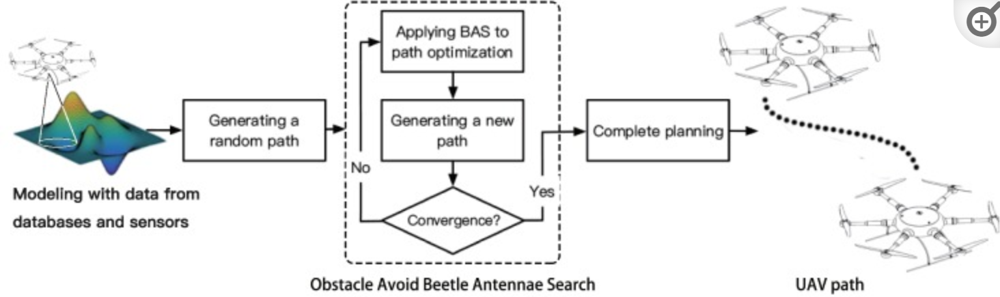

Authors
===
Qing Wu, Xudong Shen, **Yuanzhe Jin**, Zeyu Chen, Shuai Li, Ameer Hamza Khan, and Dechao Chen

Abstract
===
Based on a bio-heuristic algorithm, this paper proposes a novel path planner called obstacle avoidance beetle antennae search (OABAS) algorithm, which is applied to the global path planning of unmanned aerial vehicles (UAVs). Compared with the previous bio-heuristic algorithms, the algorithm proposed in this paper has advantages of a wide search range and breakneck search speed, which resolves the contradictory requirements of the high computational complexity of the bio-heuristic algorithm and real-time path planning of UAVs. The effectiveness of the algorithm is substantiated by applying the proposed path planning algorithm on the UAVs. Moreover, comparisons with other existing algorithms further demonstrate the superiority of the proposed OABAS algorithm.

 

[Download paper here](https://www.ncbi.nlm.nih.gov/pmc/articles/PMC6514918/)
