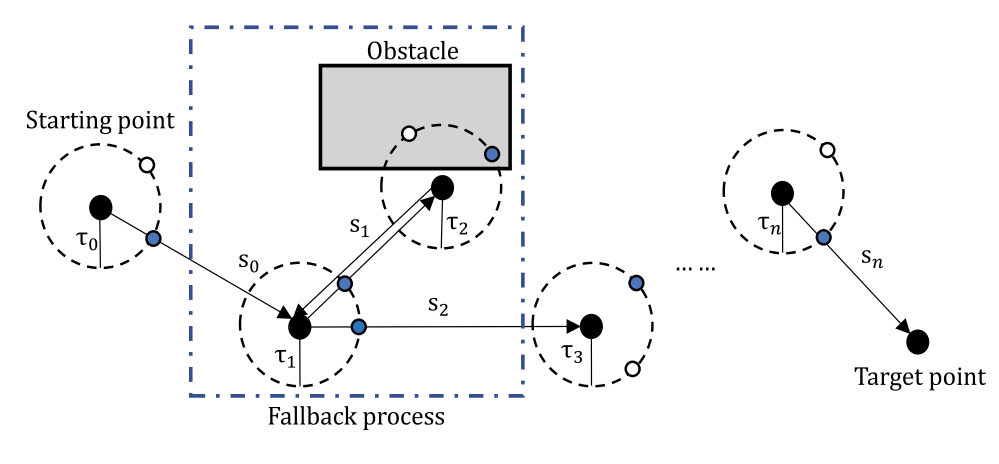

Authors
===
Qing Wu, Hao Lin, **Yuanzhe Jin**, Zeyu Chen, Shuai Li & Dechao Chen

Abstract
===
With the development of technology, mobile robots are becoming more and more common in industrial production and daily life. Various rules are set to ensure that mobile robots can move without collision. This paper proposes a novel intelligent optimization algorithm, named fallback beetle antennae search algorithm. Based on the analysis of biological habits, when the creature enters blind alley during the foraging process, it will retreat a distance and then restart the search process. We introduce a fallback mechanism in the traditional beetle antenna search algorithm. In addition, the proposed algorithm possesses the characteristic of low time complexity. It can plan a collision-free path in a short period of time. Moreover, the effectiveness and superiority of the algorithm are verified by simulations in different types of environments and comparisons with existing path planning algorithms.

[Download paper here](https://link.springer.com/article/10.1007/s00500-019-04067-3#citeas)
