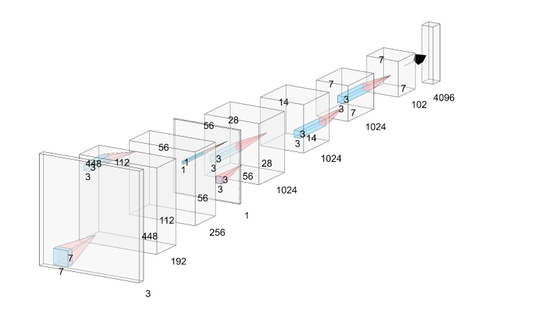

Authors
===
**Yuanzhe Jin**, Yixun Wen, Jingting Liang

Abstract
===
The main challenge for real-time pedestrian detection in an embedded system is to keep a balance between accuracy and computation cost. To solve this, the main idea is to use Lightweight Neural Network (LNN), a special design Neural Networks which can provide acceptable accuracy with faster speed. In this paper, we modify the YOLO written in Darknet with MobileNet, one of the popular LNN in the embedded system. And we realize deploying real-time pedestrian detection using the modified YOLO on the platform Jetson TX2.

[Download paper here](https://ieeexplore.ieee.org/abstract/document/9179384)
