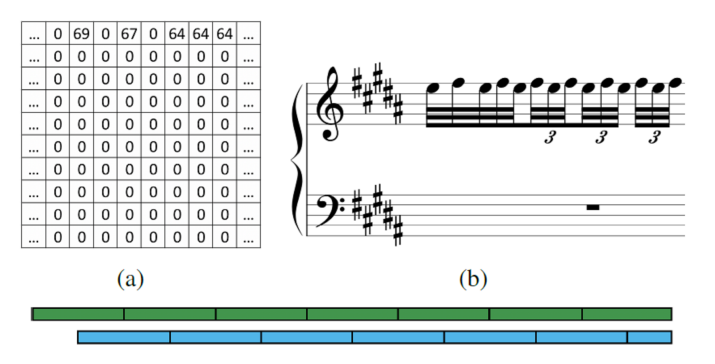

Authors
===
**Yuanzhe Jin**; Maorong Wang

Abstract
===
Piano music scores saved by MIDI are easy for the machine to play, but when ordinary people want to play music with this score, they will find it difficult to distinguish the left and right-hand scores. In this article, we give the algorithm based on the neural network that combines long and short-term memory (LSTM) and “Map”. By using this algorithm, a single track piano score in a MIDI file can be divided into two-hand piano scores.
.

 
  
[Download paper here](https://ieeexplore.ieee.org/abstract/document/9291967)
