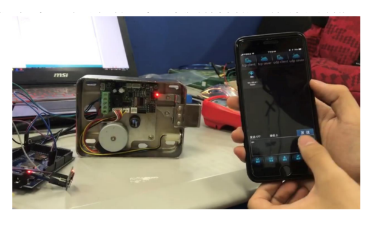

Authors
===
**Yuanzhe Jin**, Chenrui Zhang, Maorong Wang

Abstract
===
In most student dorms in developing countries, a large number of people live in single-function dorm units. The division of dormitory is too fixed, resulting in the dormitory often lacking functional spaces such as entertainment, sports, meetings, etc. At the same time, a large number of people are likely to cause aggregation at a fixed time, which is not conducive to maintaining social distance under pandemic conditions such as COVID-19. This brings a lot of inconvenience to students' life study and management staff.
In this paper, we present a smart dormitory system named Otaku using the Internet of Things technology to integrate facilities related to student dormitory life. By splitting the dormitory into several different categories according to their functionality by using smart door lock design, the system can achieve a more effective and flexible resource allocation, which not only helps the school management but also benefits students.

  
[Download paper here](http://arxiv.org/abs/2104.07630)
