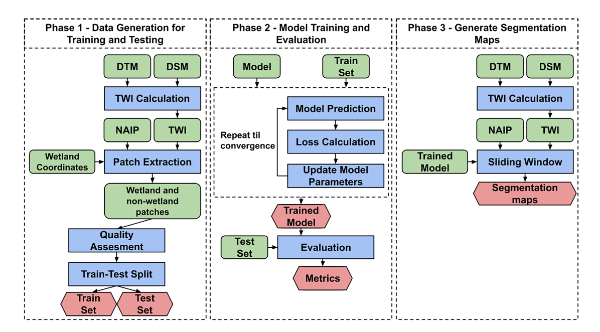

Authors
===
Santiago López-Tapia, Pablo Ruiz, Mitchell Smith, Jeffrey Matthew, Bradley Zercher, Liliana Sydorenko, Neelanshi Varia, **Yuanzhe Jin**, Minzi Wang, Jennifer B.Dunn, Aggelos K. Katsaggelos

Abstract
===
Wetlands serve many important ecosystem services, yet the United States lacks up-to-date, high-resolution wetland inventories. New, automated techniques for developing wetland segmentation maps from high-resolution aerial imagery can improve our understanding of the location and amount of wetlands. We assembled training and testing data sets (patch sizes of 28 × 28 m2 and 56 × 56 m2) of high-resolution aerial imagery of wetlands using Illinois Natural History Survey wetland location data and National Agricultural Imagery Project data. Each patch was labeled as wetland or non-wetland. To augment these data sets with additional information, we incorporated digital surface and digital terrain models and topographic wetness index data in the same two patch sizes. Subsequently, we evaluated convolutional neural network (CNN) and Gaussian process-based machine learning methods to produce wetland segmentation maps. We developed the best performing method into a new CNN algorithm, WetSegNet. It exhibited an area under the curve of 98% when used with 56 × 56 m2 patch sizes. WetSegNet developed reliable wetland segmentation maps in test cases in which wetlands would have gone undetected using only the National Land Cover Database. The development of WetSegNet exemplifies the types of data sets and methods that are needed to accelerate the use of high-resolution aerial imagery towards an improved understanding of wetlands. This algorithm could be used by state and federal agencies or other groups to identify wetlands with higher accuracy and at a finer scale than previously possible.

[Download paper here](https://www.sciencedirect.com/science/article/pii/S0303243421002889)
